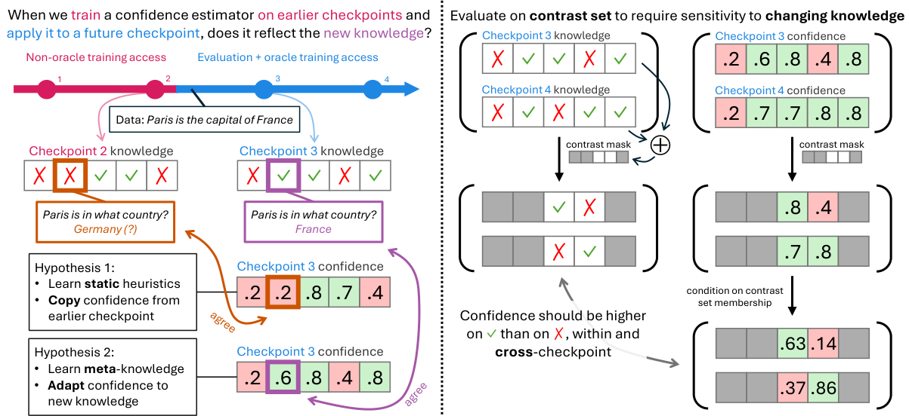

# [Evaluating Persistent Calibration under Evolving Model Knowledge](https://arxiv.org/abs/2609.38797)

Authors: [Victor Wang](https://victorwang37.github.io/), [Thomas Hofweber](https://thomashofweber.com/), [Mohit Bansal](https://www.cs.unc.edu/~mbansal/), [Elias Stengel-Eskin](https://esteng.github.io/)

**(Left)** Our setup for evaluating persistent calibration. During training, the model encounters the training data instance *"Paris is the capital of France"*, causing a change in knowledge between checkpoints C2 and C3. A confidence estimator that is faithful to the model's evolving knowledge (Hypothesis 2) should produce a higher confidence on the checkpoint C3 with increased knowledge; however, an estimator could instead capture Hypothesis 1, which performs equally well on the training distribution C2 but fails to generalize to C3. **(Right)** To measure the dependence of confidence on knowledge, we evaluate calibration on a contrast set consisting of questions that one checkpoint answers correctly and another checkpoint answers incorrectly, testing whether a change in knowledge is accompanied by a change in confidence.

## Usage

See [scripts/README.md](scripts/README.md) for instructions on running the code.
